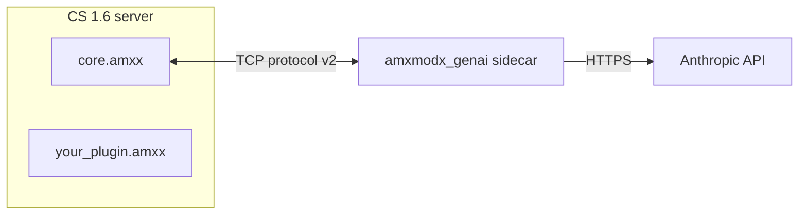

# AMX Mod X GenAI

[](https://github.com/omar-hindawi98/amxmodx-genai/releases)
[](https://www.amxmodx.org/)
[](https://www.python.org/)
[](LICENSE)

[](https://github.com/omar-hindawi98/amxmodx-genai/actions/workflows/ci.yml)
[](https://github.com/omar-hindawi98/amxmodx-genai/actions/workflows/e2e.yml)

LLM agent bridge for AMX Mod X game servers. Plugins call simple Pawn natives; a local Python TCP sidecar runs a Strands agent loop against the Anthropic API (or a local Ollama model) with two-tier persistent memory, plugin-registered tools and skills, and a composable system prompt.



## Requirements

- [AMX Mod X Sockets](https://www.amxmodx.org/sc/sockets.php) module
- [uv](https://docs.astral.sh/uv/)

## Installation

### Sidecar

```sh
uv sync
GENAI_MODEL_API_KEY=sk-ant-... uv run genai-sidecar
```

Use Ollama instead of the Anthropic API:

```sh
GENAI_MODEL_BACKEND=ollama GENAI_MODEL_NAME=llama3.2 uv run genai-sidecar
```

### AMX Mod X plugin

1. Compile `plugins/amxmodx_genai/core.sma` and copy `core.amxx` to `addons/amxmodx/plugins/`.
2. Copy `plugins/include/amxmodx_genai.inc` to `addons/amxmodx/scripting/include/`.
3. Add `core.amxx` before your plugin in `addons/amxmodx/configs/plugins.ini`.

## Configuration

### CVars (game server)

| CVar                | Default     | Description                               |
| ------------------- | ----------- | ----------------------------------------- |
| `genai_host`        | `127.0.0.1` | Sidecar host                              |
| `genai_port`        | `27016`     | Sidecar port                              |
| `genai_core_tools`  | `1`         | Enable built-in sidecar tools             |
| `genai_core_skills` | `1`         | Enable built-in `amxmodx-reference` skill |

### Environment variables (sidecar)

| Variable                        | Default                                  | Description                                                                                                                                                            |
| ------------------------------- | ---------------------------------------- | ---------------------------------------------------------------------------------------------------------------------------------------------------------------------- |
| `GENAI_HOST`                    | `127.0.0.1`                              | Bind address                                                                                                                                                           |
| `GENAI_PORT`                    | `27016`                                  | Bind port                                                                                                                                                              |
| `GENAI_MAX_CONCURRENT`          | `32`                                     | Maximum simultaneous in-flight requests                                                                                                                                |
| `GENAI_REQUEST_TIMEOUT_SECONDS` | `60`                                     | Per-request LLM timeout in seconds. Set to `0` to disable.                                                                                                             |
| `GENAI_AUTH_TOKEN`              | ``                                       | When non-empty, every `query` and `clear_memory` message must include a matching `auth_token` field or the request is rejected. Leave empty to disable auth (default). |
| `GENAI_LOG_LEVEL`               | `INFO`                                   | Log verbosity: `DEBUG`, `INFO`, `WARNING`, `ERROR`                                                                                                                     |
| `GENAI_MODEL_BACKEND`           | `anthropic`                              | LLM backend: `anthropic`, `bedrock`, `ollama`, `litellm`, or `openai`                                                                                                  |
| `GENAI_MODEL_NAME`              | `claude-haiku-4-5-20251001`              | Model ID passed to the backend                                                                                                                                         |
| `GENAI_MODEL_TOKENS`            | `2048`                                   | `max_tokens` per response                                                                                                                                              |
| `GENAI_MODEL_API_KEY`           | ``                                       | API key for `anthropic`, `openai`, and `litellm` backends                                                                                                              |
| `GENAI_MODEL_ENDPOINT`          | ``                                       | Custom endpoint URL (Ollama: `http://localhost:11434`, OpenAI-compatible proxies, etc.)                                                                                |
| `GENAI_MEMORY_PATH`             | `~/.local/share/amxmodx_genai/memory.db` | SQLite memory file                                                                                                                                                     |
| `GENAI_MEMORY_MAX_MESSAGES`     | `20`                                     | Conversation turns to keep in short-term memory (counts turns, not individual messages)                                                                                |
| `GENAI_SKILLS_PATH`             | `~/.local/share/amxmodx_genai/skills`    | Directory where plugin skill subdirectories are resolved                                                                                                               |

## Plugin API

```pawn
#include <amxmodx_genai>

// Send a prompt; response delivered to callback(player, response[])
native genai_query(player, const prompt[], const callback[], const session_id[] = "");

// Cancel a pending query (no callback fired)
native genai_cancel(player, const session_id[] = "");

// Returns true if a query is outstanding for this player/session
native bool:genai_is_pending(player, const session_id[] = "");

// Set/append this plugin's context section in the system prompt (call in plugin_init)
native genai_set_plugin_context(const context[]);
native genai_append_plugin_context(const content[]);

// Clear short-term memory for a session (triggers long-term summarization)
native genai_clear_memory(player, const session_id[] = "");

// Register a tool Claude can call mid-reasoning
// Tool name is auto-prefixed: "get_map" in "my_plugin.amxx" -> "my_plugin__get_map"
// callback: public MyTool(player, const args_json[], result[], maxlen)
native genai_register_tool(const name[], const description[], const callback[]);

// Declare a typed parameter for the most recently registered tool
native genai_add_tool_param(const name[], const type[], bool:required, const description[]);

// Register a skill by name (auto-prefixed, loaded from GENAI_SKILLS_PATH)
native genai_register_skill(const name[]);

// Returns true if the last response for this player was a sidecar error (not an AI reply)
// Call inside your genai_query callback to handle errors without string-matching
native bool:genai_is_error(player, const session_id[] = "");

// Delete long-term (summary) memory for a session without summarizing first
// Use for a full reset; genai_clear_memory summarizes then clears short-term only
native genai_clear_longterm_memory(player, const session_id[] = "");
```

### Minimal example

```pawn
#include <amxmodx>
#include <amxmodx_genai>

public plugin_init()
{
    register_plugin("My Plugin", "1.0.0", "me");
    genai_set_plugin_context("You are a helpful Counter-Strike coach.");
    register_clcmd("say /ask", "cmd_ask");
}

public cmd_ask(id)
{
    if (genai_is_pending(id))
    {
        client_print(id, print_chat, "[AI] Still thinking...");
        return PLUGIN_HANDLED;
    }
    new args[256];
    read_args(args, sizeof(args) - 1);
    remove_quotes(args);
    genai_query(id, args, "on_response");
    return PLUGIN_HANDLED;
}

public on_response(id, const response[])
{
    client_print(id, print_chat, "[AI] %s", response);
}

public client_disconnect(id)
{
    genai_cancel(id);
    genai_clear_memory(id);
}
```

### Tools with typed parameters

```pawn
public plugin_init()
{
    genai_register_tool("get_player_info", "Returns info about a player", "tool_player_info");
    genai_add_tool_param("player_id", "integer", true,  "Player index 1-32");
    genai_add_tool_param("verbose",   "boolean", false, "Include frags and deaths");
}

public tool_player_info(player, const args[], result[], maxlen)
{
    new pid = json_get_int(args, "player_id");
    // ... fill result
    return 1;
}
```

See [docs/plugin-api.md](docs/plugin-api.md) for the full API reference.

## Memory

The sidecar maintains two tiers of memory per session:

- **Short-term**: raw conversation turns (last 20 turns, configurable via `memory_max_messages` env var, which counts turns not individual messages), cleared on `genai_clear_memory`.
- **Long-term**: LLM-generated summary persisted across sessions. Automatically updated when short-term memory is cleared. Injected into the next session's system prompt so the agent remembers past interactions.

Session IDs default to the player's SteamID. For bots and LAN clients without a SteamID, they fall back to the client index. Override by passing a custom `session_id` to `genai_query` to share memory across players or create player-independent sessions.

## Contributing

See [CONTRIBUTING.md](CONTRIBUTING.md).

## License

MIT - see [LICENSE](LICENSE).
