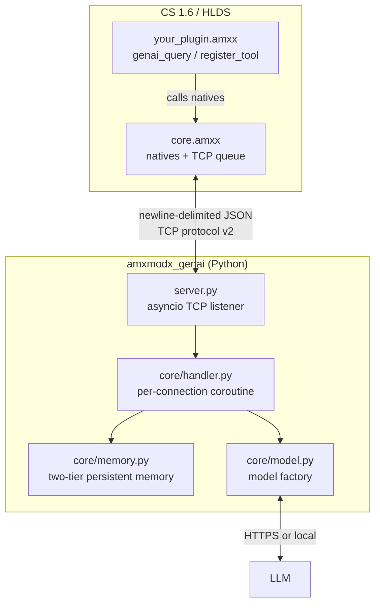

# Architecture

## Overview

amxmodx_genai is a generic AI agent bridge for AMX Mod X game servers. It connects any AMX Mod X plugin to a configurable LLM backend through a local Python sidecar. The game server never speaks HTTPS directly; the sidecar owns that boundary.

Plugin authors wire their own tools, system prompts, skills, and session logic. The bridge itself provides no game-specific knowledge.

## Key design decisions

**One persistent TCP socket, multiplexed across multiple queries.**
The AMX Mod X sockets API is non-blocking and poll-based. A single socket connection is opened on the first query and remains open indefinitely, multiplexing multiple concurrent queries using `request_id` fields to match requests with responses. The poll task (`task_poll_sockets`) reads all complete JSON lines per tick and dispatches them to the appropriate handler based on `request_id`. Queue slots are freed when `type=done` arrives for that request. When the queue is empty, the poll task stops and is restarted by the next `genai_query` call. See [ADR 001](adr/001-persistent-multiplexed-tcp-socket.md).

**Two-tier persistent memory.**
Short-term memory (raw conversation turns) lives in the `sessions` SQLite table and is cleared when `genai_clear_memory` is called. The number of turns kept is controlled by `GENAI_MEMORY_MAX_MESSAGES`, which counts conversation *turns* (user+assistant pairs), not individual messages. Long-term memory lives in the `longterm` table as an LLM-generated summary. When short-term memory is cleared, the sidecar summarizes the session and merges it into long-term memory before deleting the raw turns. On the next query, the summary is injected under `## Memory from previous sessions` in the system prompt. Both tables share a single WAL-mode SQLite file (`GENAI_MEMORY_PATH`). See [ADR 002](adr/002-two-tier-persistent-memory.md).

**Tools and skills are namespaced by plugin filename.**
Both `genai_register_skill` and `genai_register_tool` prefix the registered name with the calling plugin's filename (minus `.amxx`) and a double underscore: `my_plugin__tool_name`. Two plugins can each register `"strategy"` or `"get_map"` with no collision. See [ADR 003](adr/003-plugin-naming-convention.md).

**Typed tool parameters via builder pattern.**
`genai_register_tool` is followed by `genai_add_tool_param` calls that build a JSON Schema incrementally in Pawn. The sidecar converts this to a Strands `inputSchema` so the model receives proper type constraints rather than guessing from the description. See [ADR 004](adr/004-typed-tool-parameters.md).

**Plugin-registered tools stay in AMX Mod X.**
Tools round-trip: the sidecar sends `tool_call` to the game server, the plugin callback runs synchronously, and the result comes back as `tool_result` on the same socket. Native sidecar tools (e.g. `current_datetime`) resolve without a round-trip. See [ADR 005](adr/005-plugin-tool-round-trip.md).

**Immutable base system prompt.**
The sidecar always loads `SYSTEM_PROMPT.md` as the base. Plugins can only append their own `## plugin_name` section via `genai_set_plugin_context` / `genai_append_plugin_context`. Headings inside plugin context are shifted down two levels automatically so they never conflict with the base structure.

**Swappable model backend.**
Set `GENAI_MODEL_BACKEND` to switch LLM providers without code changes. Supported values: `ollama` (default, local), `anthropic`, `bedrock` (AWS), `litellm` (proxy - covers OpenRouter, Groq, Cohere, etc.), `openai` (OpenAI-compatible API).

**Session memory TTL and concurrency.**
`GENAI_MEMORY_SESSION_TTL_DAYS` (default `0`, disabled) enables a background vacuum that removes sessions inactive for the specified number of days, preventing unbounded SQLite growth on long-running servers. `GENAI_SESSION_CONCURRENCY` (default `1`) controls how many in-flight requests are allowed per `session_id` simultaneously; raise it above `1` for shared sessions where multiple players query the same conversation at once (e.g. team sessions).

## Component map

| File | Responsibility |
|------|---------------|
| `plugins/amxmodx_genai/core.sma` | AMX Mod X plugin: native registration, socket queue, poll loop, message dispatch |
| `plugins/amxmodx_genai/include/constants.inc` | Shared `#define` limits |
| `plugins/amxmodx_genai/include/json.inc` | Minimal flat-JSON parser |
| `plugins/amxmodx_genai/include/queue.inc` | Queue and tool/skill registry globals, slot helpers |
| `plugins/amxmodx_genai/include/core_tools.inc` | Built-in tool definitions (registered by core.sma) |
| `plugins/amxmodx_genai/include/core_skills.inc` | Built-in skill registration (amxmodx-reference) |
| `plugins/include/amxmodx_genai.inc` | Public native declarations for third-party plugins |
| `examples/weapon_advisor/` | Example: skills + custom tool + per-player memory |
| `examples/weapon_advisor/skills/weapon_advisor__cs16-strategy/` | Skill directory shipped alongside `weapon_advisor`; deploy to `GENAI_SKILLS_PATH` on the sidecar |
| `examples/admin_assistant/` | Example: access flags, `genai_append_plugin_context`, core tools |
| `examples/testable/` | Example: observable plugin for integration testing |
| `src/amxmodx_genai/server.py` | `asyncio.start_server` entry point; `_handle_persistent` multiplexes requests |
| `src/amxmodx_genai/config.py` | Pydantic settings loaded from `GENAI_*` env vars |
| `src/amxmodx_genai/logger.py` | Root logger configuration (level, format); call `setup()` once at startup |
| `src/amxmodx_genai/core/handler.py` | Per-connection logic: reads query, runs agent, manages memory, sends frames |
| `src/amxmodx_genai/core/protocol.py` | JSON framing helpers |
| `src/amxmodx_genai/core/memory.py` | SQLite-backed two-tier memory: short-term turns + long-term summaries; vacuum task |
| `src/amxmodx_genai/core/model.py` | Model factory: multi-backend LLM provider (Bedrock, Ollama, LiteLLM, OpenAI-compatible) |
| `src/amxmodx_genai/core/messages.py` | Message type definitions for the wire protocol |
| `src/amxmodx_genai/core/summarize.py` | LLM-based session summarization for long-term memory |
| `src/amxmodx_genai/tools/plugin.py` | Dynamic tool factory for AMX Mod X-registered tools (typed JSON schema, ID-matched round-trip) |
| `src/amxmodx_genai/tools/native.py` | Built-in sidecar tools (e.g. `current_datetime`) resolved without a game server round-trip |
| `src/amxmodx_genai/skills/loader.py` | Loads `AgentSkills` from disk for plugin-registered and built-in skills |
| `src/amxmodx_genai/SYSTEM_PROMPT.md` | Immutable base agent persona |

