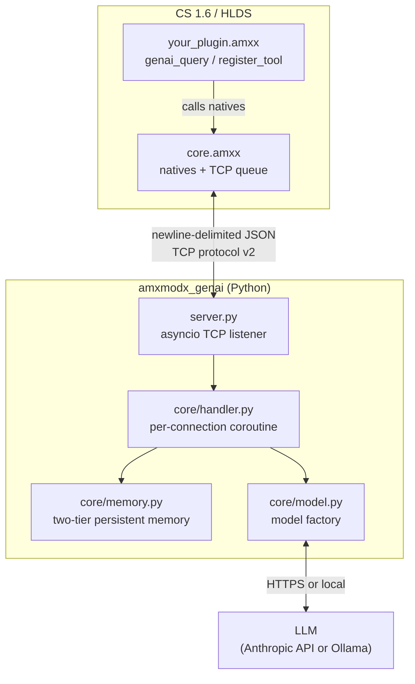

# Architecture

## Overview

amxmodx_genai is a generic AI agent bridge for AMXMODX game servers. It connects any AMXMODX plugin to the Anthropic API (or a local Ollama model) through a local Python sidecar. The game server never speaks HTTPS directly; the sidecar owns that boundary.

Plugin authors wire their own tools, system prompts, skills, and session logic. The bridge itself provides no game-specific knowledge.

## Key design decisions

**One TCP socket per query, kept open.**
The AMXMODX sockets API is non-blocking and poll-based. Rather than reconnecting for each tool call, the socket stays open for the full agent loop. The poll task (`task_poll_sockets`) reads all complete JSON lines per tick and dispatches them; the slot is freed only when `type=done` arrives.

**Two-tier persistent memory.**
Short-term memory (raw turns, last 20) lives in the `sessions` SQLite table and is cleared when `genai_clear_memory` is called. Long-term memory lives in the `longterm` table as an LLM-generated summary. When short-term memory is cleared, the sidecar summarizes the session and merges it into long-term memory before deleting the raw turns. On the next query, the summary is injected under `## Memory from previous sessions` in the system prompt. Both tables share a single WAL-mode SQLite file (`GENAI_MEMORY_PATH`).

**Skills and tools are namespaced by plugin filename.**
Both `genai_register_skill` and `genai_register_tool` prefix the registered name with the calling plugin's filename (minus `.amxx`) and a double underscore: `my_plugin__tool_name`. Two plugins can each register `"strategy"` or `"get_map"` with no collision.

**Typed tool parameters via builder pattern.**
`genai_register_tool` is followed by `genai_add_tool_param` calls that build a JSON Schema incrementally in Pawn. The sidecar converts this to a Strands `inputSchema` so the model receives proper type constraints rather than guessing from the description.

**Plugin-registered tools stay in AMXMODX.**
Tools round-trip: the sidecar sends `tool_call` to the game server, the plugin callback runs synchronously, and the result comes back as `tool_result` on the same socket. Native sidecar tools (e.g. `current_datetime`) resolve without a round-trip.

**Immutable base system prompt.**
The sidecar always loads `SYSTEM_PROMPT.md` as the base. Plugins can only append their own `## plugin_name` section via `genai_set_plugin_context` / `genai_append_plugin_context`. Headings inside plugin context are shifted down two levels automatically so they never conflict with the base structure.

**Swappable model backend.**
Set `GENAI_BACKEND=ollama` to use a local Ollama model. Configured via environment variables; no code changes needed.

## Component map

| File | Responsibility |
|------|---------------|
| `plugins/amxmodx_genai/core.sma` | AMXMODX plugin: native registration, socket queue, poll loop, message dispatch |
| `plugins/amxmodx_genai/include/constants.inc` | Shared `#define` limits |
| `plugins/amxmodx_genai/include/json.inc` | Minimal flat-JSON parser |
| `plugins/amxmodx_genai/include/queue.inc` | Queue and tool/skill registry globals, slot helpers |
| `plugins/include/amxmodx_genai.inc` | Public native declarations for third-party plugins |
| `src/amxmodx_genai/server.py` | `asyncio.start_server` entry point |
| `src/amxmodx_genai/core/handler.py` | Per-connection logic: reads query, runs agent, manages memory, sends frames |
| `src/amxmodx_genai/core/protocol.py` | JSON framing helpers |
| `src/amxmodx_genai/core/memory.py` | SQLite-backed two-tier memory: short-term turns + long-term summaries |
| `src/amxmodx_genai/core/model.py` | Model factory: Anthropic or Ollama |
| `src/amxmodx_genai/tools/plugin.py` | Dynamic tool factory for AMXMODX-registered tools (typed JSON schema, ID-matched round-trip) |
| `src/amxmodx_genai/tools/native.py` | Built-in sidecar tools (e.g. `current_datetime`) resolved without a game server round-trip |
| `src/amxmodx_genai/skills/loader.py` | Loads `AgentSkills` from disk for plugin-registered and built-in skills |
| `src/amxmodx_genai/SYSTEM_PROMPT.md` | Immutable base agent persona |

## Test layout

| Path | What it tests |
|------|---------------|
| `tests/unit/` | Pure Python: memory module, tool schema builder |
| `tests/e2e/test_server.py` | TCP handler with mocked Strands Agent - no API key needed |
| `tests/e2e/test_live.py` | Full stack against a real sidecar - requires `GENAI_SIDECAR_HOST` and `pytest -m live` |
| `tests/plugins/` | Pawn e2e tests run inside a real HLDS container via `docker compose` |
