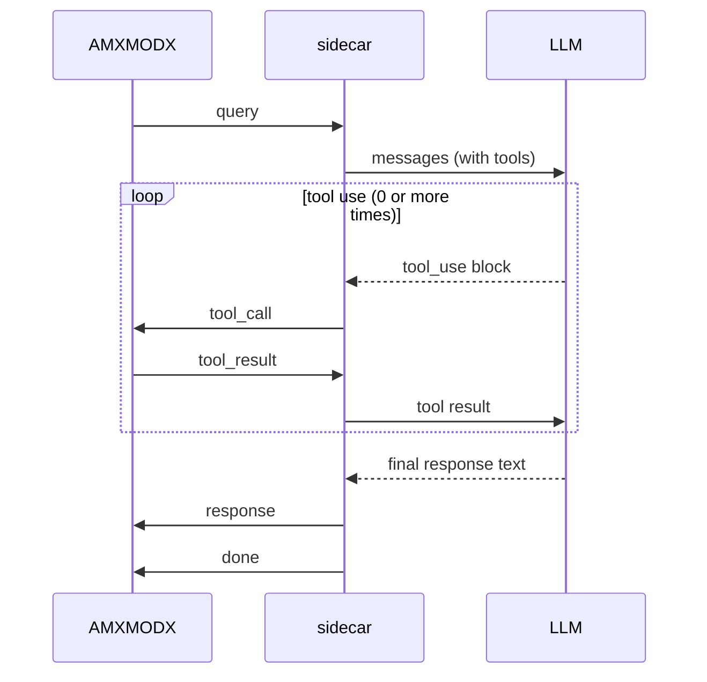

# Wire Protocol v2

All messages are newline-terminated JSON (`\n`) over a single TCP connection. One connection is opened per query and held open for the full agent loop. The connection is closed by the sidecar after sending `done`.

## Message flow



`tool_call` / `tool_result` pairs may repeat.

## Message types

### query (AMXMODX -> sidecar)

```json
{
  "type": "query",
  "player": 3,
  "session_id": "ct_team",
  "plugin": "my_plugin",
  "prompt": "what should we do this round?",
  "system": "You are a team assistant. Keep answers brief.",
  "tools": [
    {
      "name": "my_plugin__get_score",
      "description": "Returns current score",
      "params": [{"name": "team", "type": "string", "required": false, "description": "ct or t"}]
    }
  ],
  "skills": ["my_plugin__strategy"]
}
```

| Field | Type | Description |
|-------|------|-------------|
| `player` | int | AMXMODX client index used for callback routing (0 = server context) |
| `session_id` | string | Memory key. Defaults to `str(player)` when absent or empty. |
| `plugin` | string | Plugin filename (minus `.amxx`), used to name the system prompt section |
| `prompt` | string | User message |
| `system` | string | Per-plugin context text (appended under `## <plugin>` in the system prompt) |
| `tools` | array | Plugin-registered tool definitions visible to the LLM |
| `skills` | array | Skill directory names to load for this query |

### tool_call (sidecar -> AMXMODX)

```json
{"type": "tool_call", "id": "toolu_01abc", "name": "my_plugin__get_score", "args": "{\"team\":\"ct\"}"}
```

`args` is a JSON object serialised as a string. Use `json_get_string` / `json_get_int` from `json.inc` to parse it in the tool callback.

### tool_result (AMXMODX -> sidecar)

```json
{"type": "tool_result", "id": "toolu_01abc", "content": "CT 5 - T 3"}
```

`id` must match the `tool_call` that triggered this result.

### response (sidecar -> AMXMODX)

```json
{"type": "response", "text": "Rush B this round - CTs are rotating slow."}
```

The final conversational text from the agent.

### done (sidecar -> AMXMODX)

```json
{"type": "done"}
```

Signals end of the agent turn. The AMXMODX queue slot is freed and the socket is closed.

---

### clear_memory (AMXMODX -> sidecar, separate connection)

```json
{"type": "clear_memory", "player": 3, "session_id": "ct_team"}
```

Sent on a short-lived connection (opens, sends, closes). The sidecar clears persistent memory for `session_id` (falls back to `str(player)` when absent) and closes without replying.

## Encoding

- All messages are UTF-8
- String values in JSON use standard JSON escaping (`\"`, `\\`, `\n`)
- The Pawn side uses `json_escape()` / `json_get_string()` from `json.inc`
