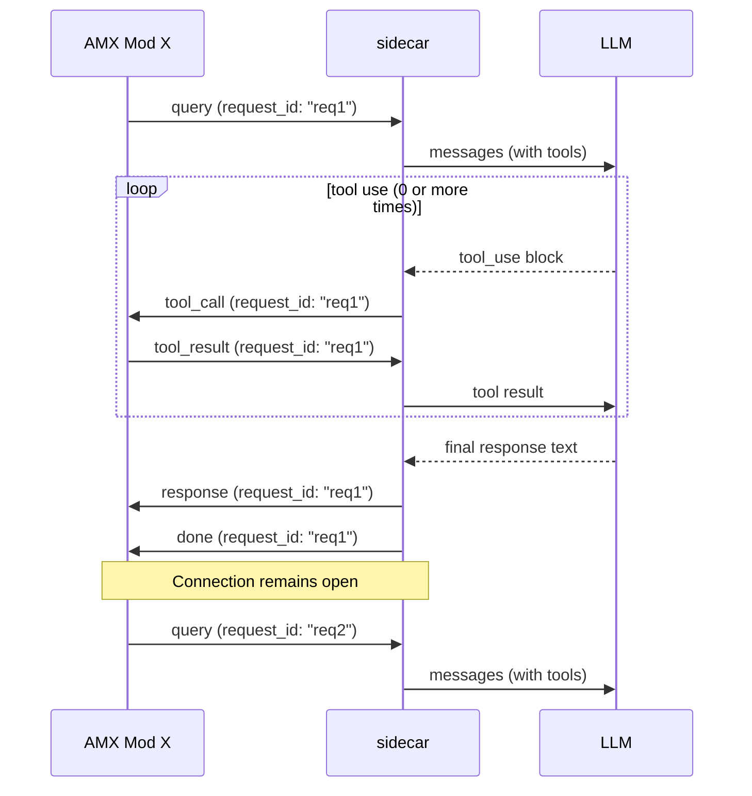

# Wire Protocol v2

All messages are newline-terminated JSON (`\n`) over a single persistent TCP connection. The connection is opened when the first query arrives and held open indefinitely across multiple queries. All queries are multiplexed over this socket using a `request_id` field to match requests with responses. The connection closes only when the plugin shuts down or encounters an error.

## Message flow

Multiple queries are multiplexed over one persistent TCP connection, identified by `request_id`:



Each message includes a `request_id` to correlate requests with their responses. `tool_call` / `tool_result` pairs may repeat within a single request.

## Message types

### query (AMX Mod X -> sidecar)

```json
{
  "type": "query",
  "request_id": "req1",
  "player": 3,
  "session_id": "STEAM_0:1:12345",
  "plugin": "my_plugin",
  "prompt": "what should we do this round?",
  "system": "You are a team assistant. Keep answers brief.",
  "auth_token": "mysecret",
  "tools": [
    {
      "name": "my_plugin__get_score",
      "description": "Returns current score",
      "params": [{"name": "team", "type": "string", "required": false, "description": "ct or t"}]
    }
  ],
  "skills": ["my_plugin__strategy"]
}
```

| Field | Type | Description |
|-------|------|-------------|
| `request_id` | string | Unique request identifier for multiplexing responses to requests over the persistent connection |
| `player` | int | AMX Mod X client index used for callback routing (0 = server context) |
| `session_id` | string | Memory key. Defaults to player's SteamID (via `get_user_authid`) when absent or empty. Falls back to `str(player)` for bots and LAN clients without a SteamID. Max 256 characters. |
| `plugin` | string | Plugin filename (minus `.amxx`), used to name the system prompt section |
| `prompt` | string | User message. Max 8192 characters. |
| `system` | string | Per-plugin context text (appended under `## <plugin>` in the system prompt). Max 32768 characters. |
| `auth_token` | string | Required when `GENAI_AUTH_TOKEN` is set on the sidecar. Must match exactly or the request is rejected with `(unauthorized)`. Omit when auth is disabled (default). |
| `tools` | array | Plugin-registered tool definitions visible to the LLM |
| `skills` | array | Skill directory names to load for this query |

### tool_call (sidecar -> AMX Mod X)

```json
{"type": "tool_call", "request_id": "req1", "id": "toolu_01abc", "name": "my_plugin__get_score", "args": "{\"team\":\"ct\"}"}
```

`request_id` identifies which query this tool call belongs to. `args` is a JSON object serialised as a string. Use `json_get_string` / `json_get_int` from `json.inc` to parse it in the tool callback.

### tool_result (AMX Mod X -> sidecar)

```json
{"type": "tool_result", "request_id": "req1", "id": "toolu_01abc", "content": "CT 5 - T 3"}
```

`request_id` identifies which query this result belongs to. `id` must match the `tool_call` that triggered this result.

### response (sidecar -> AMX Mod X)

```json
{"type": "response", "request_id": "req1", "text": "Rush B this round - CTs are rotating slow.", "status": "ok"}
```

The final conversational text from the agent. `request_id` identifies which query this response belongs to.

| Field | Type | Description |
|-------|------|-------------|
| `text` | string | The response text, or an error message when `status` is `"error"` |
| `status` | string | `"ok"` for a real agent response; `"error"` for sidecar-generated errors (timeout, unauthorized, unavailable, etc.) |

Use `status` to distinguish AI responses from error strings without string-matching. Error text values: `(unauthorized)`, `(request timed out)`, `(AI unavailable)`, `(invalid request)`, `(unknown request type)`, `(empty prompt)`.

### done (sidecar -> AMX Mod X)

```json
{"type": "done", "request_id": "req1"}
```

Signals end of the agent turn for the given `request_id`. The AMX Mod X queue slot is freed. The persistent connection remains open for future queries.

---

### clear_memory (AMX Mod X -> sidecar)

```json
{"type": "clear_memory", "request_id": "clear1", "player": 3, "session_id": "STEAM_0:1:12345", "auth_token": "mysecret"}
```

Clears short-term memory for the given `session_id` (falls back to player's SteamID or `str(player)` when absent). Before deleting the conversation turns, the sidecar summarizes the session and merges it into long-term memory. On success the sidecar sends no reply. `request_id` is included for consistency with the multiplexed protocol.

`auth_token` follows the same rules as on `query`: required when `GENAI_AUTH_TOKEN` is configured, rejected with a `response` + `done` frame otherwise.

---

### clear_longterm (AMX Mod X -> sidecar)

```json
{"type": "clear_longterm", "request_id": "clear2", "player": 3, "session_id": "STEAM_0:1:12345", "auth_token": "mysecret"}
```

Deletes the long-term summary for the given session without touching short-term memory. Unlike `clear_memory`, no summarization is performed - the summary is discarded entirely. Use for a full memory reset (e.g. season/map change where past context is no longer relevant). On success the sidecar sends no reply.

`auth_token` follows the same rules as on `query`.

## Encoding

- All messages are UTF-8
- String values in JSON use standard JSON escaping (`\"`, `\\`, `\n`)
- The Pawn side uses `json_escape()` / `json_get_string()` from `json.inc`
